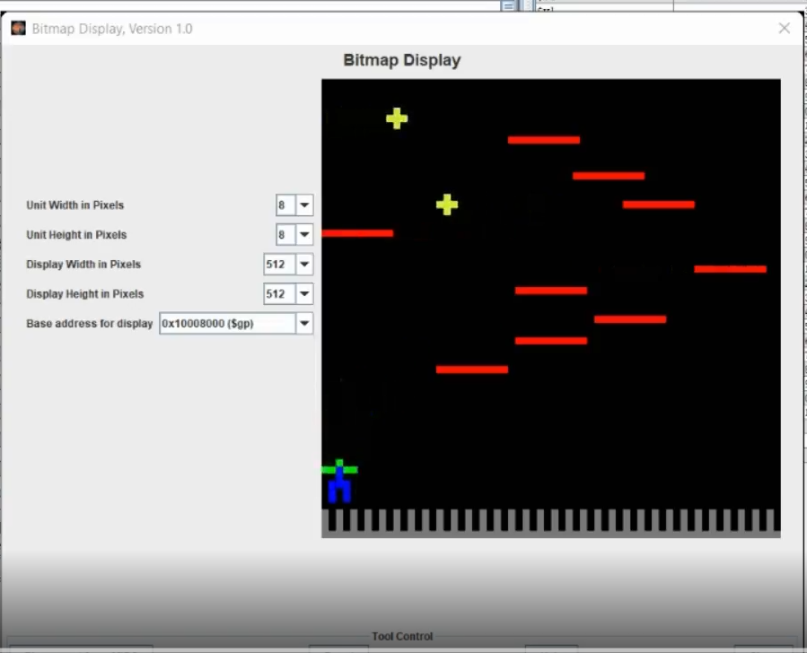

# Assembly Game

This is a simple game built in MIPS assembly. The game features both moving and static platforms. The goal is to collect all the stars. If the player falls off a platform onto the spikes below, the game ends. To win, the player must collect all stars.

## Prerequisites
- You need the MARS simulator to run the game.
- The game UI is displayed on a bitmap display.
- Use the MARS keyboard for input.

## Bitmap Display Configuration:
- Unit width in pixels: 8 (update this as needed)
- Unit height in pixels: 8 (update this as needed)
- Display width in pixels: 512 (update this as needed)
- Display height in pixels: 512 (update this as needed)
- Base Address for Display: 0x10008000 ($gp)

## How to run
- Start/Restart the game: Press p
- Quit the game: Press q
- Move the player (green/blue character):
  - a → move left
  - d → move right
  - w → jump

